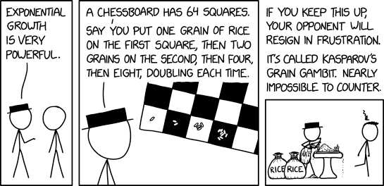
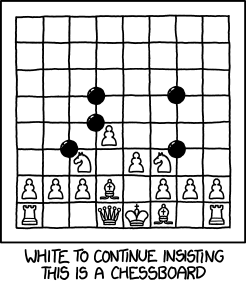
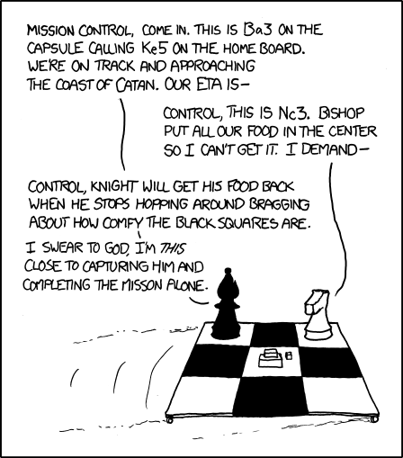
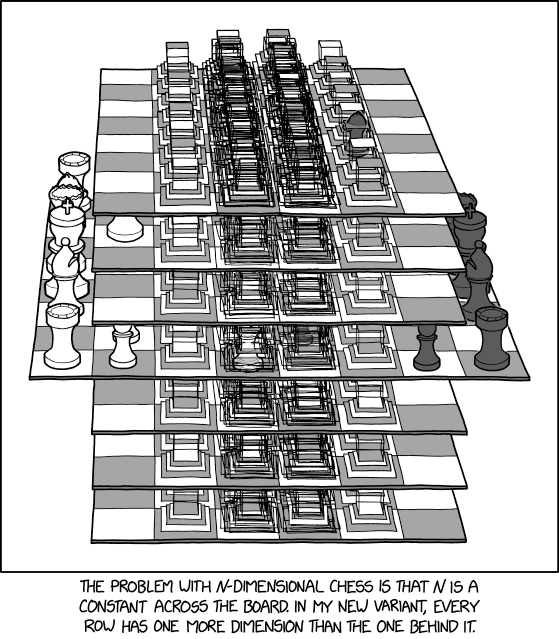

# yay! chess

This is a recreation of a simple but interesting chess engine I made in my junior year of college for a college presentation. It's named "yay!" because that's how I felt when I wrote my first chess engine. It's not nearly as powerful as the best chess engines in the world and I've learned a lot more since I first implemented the ideas in this chess engine, but it has some interesting algorithms that I found really interesting and loved implementing and talking about. This project would have been impossible without the [Chess Programming Wiki](https://chessprogramming.org). Feel free to use any of this code in your own engine for prototyping or for learning, it's MIT licensed.

Please make an issue if you see anything that may be inaccurate.

All the comics in this README.md are by [xkcd.com.](https://xkcd.com) They make pretty good comics. For example, here's one:



> Karpov's construction of a series of increasingly large rice cookers led to a protracted deadlock, but exponential growth won in the end. - [#2936](https://xkcd.com/2936/)

If you want a reason for making your own chess engine, I'd argue that it's one of the best ways to get started in managing a large codebase with multiple moving parts that require good design to not mess up other parts of the codebase. It's also an introduction to some cool techniques that have applications in the real world, like bitmasking, hashing algorithms, search algorithms, reading challenging papers to implement ideas from academia, machine learning, good data structure design, and so much more. There's no shame in copy and pasting code as long as you take the time to read, understand, and make it your own. A lot of chess engines online have very striking similarities to Stockfish...

The original is lost to time because I accidentally erased the copy while resetting my PC, but the good thing is that chess programming is a very neat topic. If you want a more in-depth explanation, visit the wiki linked above--the brillant and generous people who wrote it will be able to explain topics in much more depth than I can. If you want a simple digest of chess engine anatomy for getting started, keep reading!

There are generally three separate parts of finding a move like a chess engine:

1. **Board Representation**: Computers only known binary encodings of things, how do we represent all the intricacies of a position--where the pieces are, if we can castle, who's move is it? More importantly, how do we make it efficient to store millions of these positions in working memory? How can we implement representations that make other parts of the chess engine easier, like generating moves or assigning scores to positions?

    - Also, how do we implement a way to iterate over all possible moves of a given position? This is called *move generation*.

2. **Search**: How do we search through all the different possible combinations of moves that make a chess game? How should we distribute the limited computing power we have to search these combinations?

3. **Evaluation**: What makes a chess position winning for one side? How do we assign scores to positions so we know which moves to suggest and which moves to ignore?

Let's start by breaking down each of these topics one by one!

## Board Representation

> Prediction for Carlsen v. Anand: ... 25. Qb8+ Nxb8 26. Rd8# f6 27. "... dude." Qf5 28. "The game is over, dude." Qxg5 29. Rxe8 0-1 30. "Dude, your move can't be '0-1'. Don't write that down." [Black flips board] - [#1287](https://www.xkcd.com/1287/)



As humans, experienced chess players learn and play the game visually on a 2D 
board. Computers don't work like that. Maybe they could, with some magical computer vision model (see [chessvision.ai](https://chessvision.ai)), but it's so much easier both computationally and implementation-wise to display a chess position as a 2D-array of possible pieces.

### 8×8 Mailbox

A naive approach would be to use an enum for the twelve classes (2 sides × 6 pieces) of chess pieces, which known as the mailbox approach. This isn't necessarily a bad solution; chess engines such as Sunfish.py and even Stockfish use this idea in a modified or specialized manner to handle certain calculations that may be difficult with other representations. However, the most striking downside to using a mailbox-only approach is that move generation becomes a little more tricky to implement.
```
position = [
    [R, N, B, K, Q, B, N, K],
    [P, P, P, P, P, P, P, P],
    [0, 0, 0, 0, 0, 0, 0, 0],
    [0, 0, 0, 0, 0, 0, 0, 0],
    [0, 0, 0, 0, 0, 0, 0, 0],
    [0, 0, 0, 0, 0, 0, 0, 0],
    [p, p, p, p, p, p, p, p],
    [r, n, b, k, q, b, n, k],
]
```

In particular, checking if a move goes outside the bounds of a 8×8 chess position can be optimized by using another approach. 

### 10×12 Mailbox

Instead of having a 8×8 2D-array, we can use a 10×12 2D-array, embedding the 8×8 in the center and using the padding to detect moves that go out of bounds fast. [This is how the Sunfish.py engine implements the 10×12 mailbox.](https://github.com/thomasahle/sunfish/blob/master/sunfish.py)

```py
# sunfish.py, ln 84
# Our board is represented as a 120 character string. The padding allows for
# fast detection of moves that don't stay within the board.
initial = (
    "         \n"  #   0 -  9
    "         \n"  #  10 - 19
    " rnbqkbnr\n"  #  20 - 29
    " pppppppp\n"  #  30 - 39
    " ........\n"  #  40 - 49
    " ........\n"  #  50 - 59
    " ........\n"  #  60 - 69
    " ........\n"  #  70 - 79
    " PPPPPPPP\n"  #  80 - 89
    " RNBQKBNR\n"  #  90 - 99
    "         \n"  # 100 -109
    "         \n"  # 110 -119
)
```
The whitespace--which is the space and new lines (\n) in the string--allow Sunfish to simplify pruning invalid moves that would take pieces off the boundaries of the board into two lines:

```py
# sunfish.py, ln 163
# Stay inside the board, and off friendly pieces
if q.isspace() or q.isupper():
    break
```

> We're going to have to work together to get over our hangups if we're going to learn to move on Catan's hexagonal grid. It's bad enough that we lost our crew of pawns when we passed within firing range of Battleship. - [#839](https://www.xkcd.com/839/)



### Bitboards, and a Bit of Magic

However, mailbox approaches suffer a huge issue when it comes to generating moves: how do we general sliding piece moves? A bishop can move anywhere on its diagonal as far as it is not blocked by a piece or the board boundaries, but how do we translate that easy-for-humans concept for machines? It turns out that the best approach is to use raycasting, for every sliding direction a piece can go in, just keep iterating and checking until you get blocked. When you're dealing with millions of positions to evaluate and you have to deal with a total of 5 sliding pieces per turn that can make any of those dozens of sliding moves, it becomes computationally expensive.

That brings us to the approach that the yay! chess engine uses: bitboards. At first it sounds complicated, but it's actually pretty simple. Instead of having one 2D-array of enums, we envision 12 8×8 2D boolean arrays--one for each of the 6 piece for each of the two sides--that tells us whether the side-and-piece class occupies a square for all the 8×8 squares on a chess board. Instead of having 12 8×8 arrays however, we use the fact that an unsigned 64 bit integer has 64 bits, and can act like an array of booleans with some fancy operations that we use to manipulate individual bits for better optimization for CPU instructions.

Below is an example of the black pawn bitboard from white's perspective at the starting chess position. Notice how the only 1 bits are on the row where the black pawns start.

```py
# Let binary(str) be a function that converts a string of 1's and 0's
# into a unsigned 64 bit integer
np.uint64(71776119061282560) == binary(
    "00000000"
    "11111111" # Black's army of pawns!
    "00000000"
    "00000000"
    "00000000" # It's all zeroes because
    "00000000" # black pawns don't occupy 
    "00000000" # these squares... yet >:)
    "00000000"
)
```

Let's try making the bitboard for the white side's knights in the starting position:

```py
# Let binary(str) be a function that converts a string of 1's and 0's
# into a unsigned 64 bit integer
np.uint64(66) == binary(
    "00000000"
    "00000000"
    "00000000"
    "00000000" # The vast occupied 0's
    "00000000"
    "00000000"
    "00000000"
    "01000010" # We have to leave the 1st rank?!
)
```

All of this might look needlessly complicated and you may want to go back to mailboxes, but hold on! These bitboards have some useful properties that allow us to generate moves rather efficiently. For example, what if we want to find all the squares that the white side occupies at the starting position?

```py
bitboards = \
    Let bitboards represent an unsigned 64-bit integer array
    of length 12, where the first 6 indices refer to the occupancies
    of the six white pieces.

# initialize a zero unsigned 64-bit integer
white_occupancies = np.uint64(0)

# Find the bitwise OR of all the bitboards.
# In other words, if a 1-bit exists on any
# of the 6 piece bitboards for white, set it
# to a 1-bit on the occupancy bitboard.
for i in range(0, 6):
    white_occupancies |= bitboards[i]

print(white_occupancies) # Let's assume that this pretty-prints it as a binary number.
```

```
Output:
00000000
00000000
00000000
00000000
00000000
00000000
11111111
11111111
```

> In Dimensional Chess, every move is annotated '?!'. - [#2465](https://www.xkcd.com/2465)



With a mailbox approach, we'd need to iterate through all 64 bytes of a mailbox minimum, and see if those bytes are in the range of our white piece enums. On the other hand, the bitboard approach leverages specific CPU instructions implemented at the low-level for the explicit purpose of making calculations fast. 

What about knights and king moves? On mailbox approaches, we'd need to dynamically calculate the indices for the moves that a knight can do. For a bitboard approach, we can initialize a array of unsigned 64-bit integers with a length of 64 on startup, where each index represents a square. A knight, when not blocked by any friendly pieces, can only make one set of moves for a given square. When we need to generate moves for a knight, just look up the square in the lookup table, calculate the bitwise AND between the lookup table and the negation of the friendly side's occupancy bitboard, and then extract the bits as possible moves for that given knight.

```py
white_occupancies = \
    Calculated above, can be re-used.
idx = \
    The row-times-column index where the white knight resides
knight_lookup = \
    Let white_knight_bitboard be the bitboard of white knights

moves = knight_lookup[idx] & ~white_occupancies
```

### Sliding Piece Move Generation: My Computer is Magical?!

Remember the sliding moves that we had to brute-force with the mailbox approach? What if we use some magic hashing algorithm to create a lookup table? Note that this is a fairly more involved topic, which it seems that academia has not solved why this solution actually works, but it's used in a lot of the high-performing chess engines.

It involves starting with the set of all possible sliding moves from a given position.